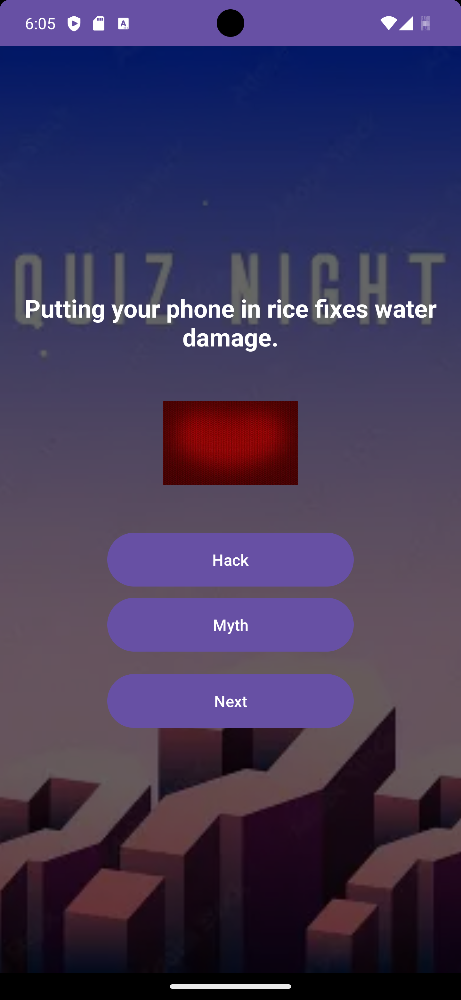

# HackOrMythApp

## 📱 Description
This is a simple Android quiz application where users answer "Hack or Myth" questions and receive a score at the end.

## 🚀 Features
- Start quiz button
- Multiple questions (Hack or Myth)
- Score calculation
- Feedback based on score
- Review answers feature

## 📸 Screenshots

### Home Screen

### Quiz Screen

### Score Screen

## 🎥 Video Demo
[Watch the demo](https://youtu.be/22OHlc0RKyI?si=kOo5BvjqXFBHAj8Z)

## 🛠️ Technologies Used
- Kotlin
- Android Studio

## ✅ Testing
The application was tested on an Android emulator and runs correctly without crashes.

## 📌 Author
Nathan Kabongo ST10458304