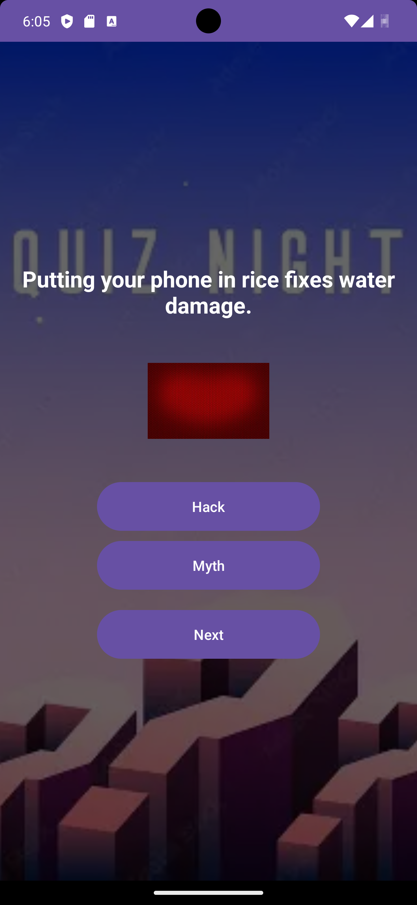
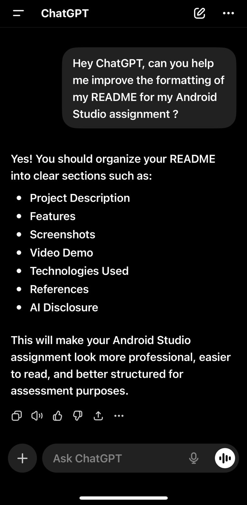
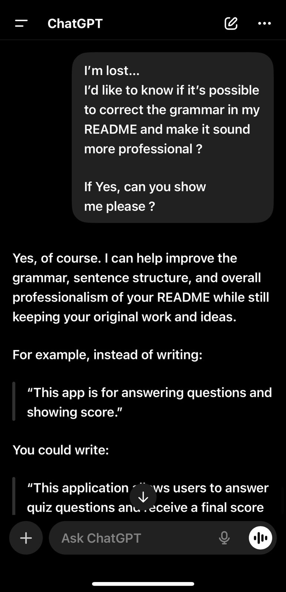
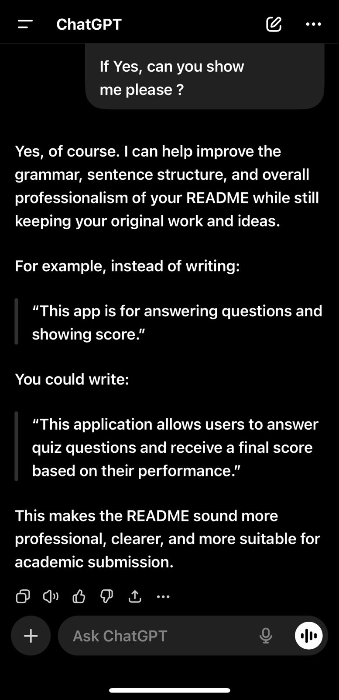
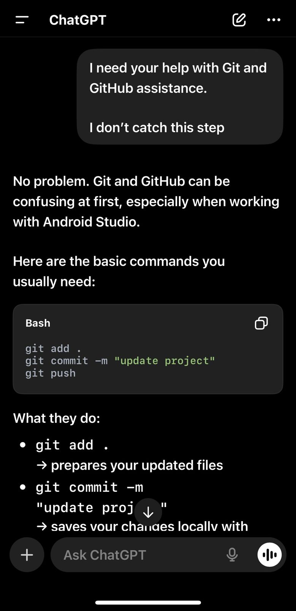
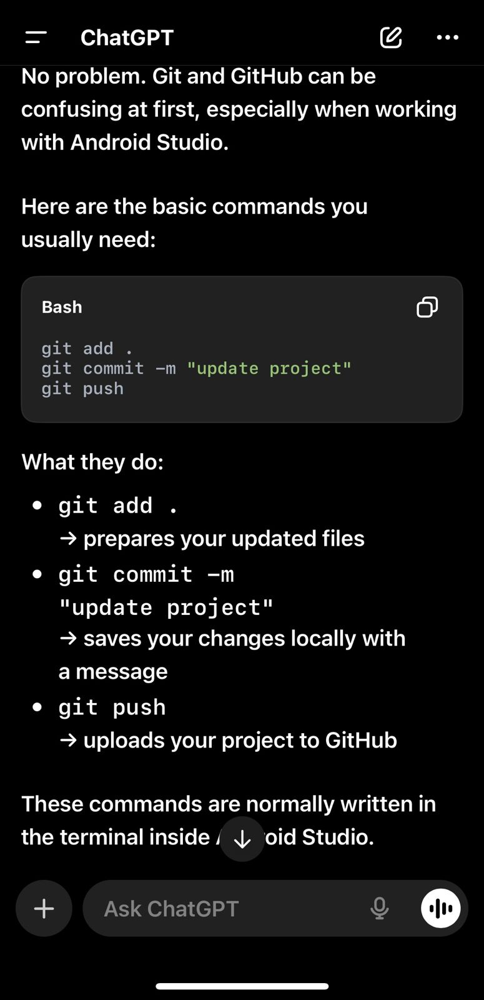
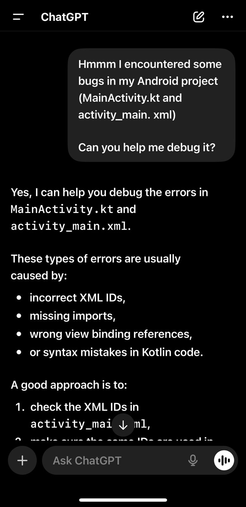
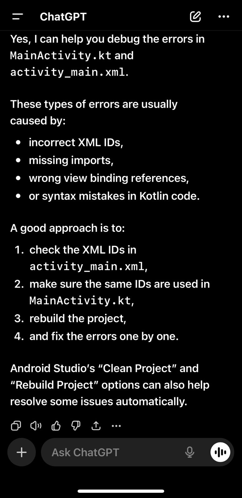
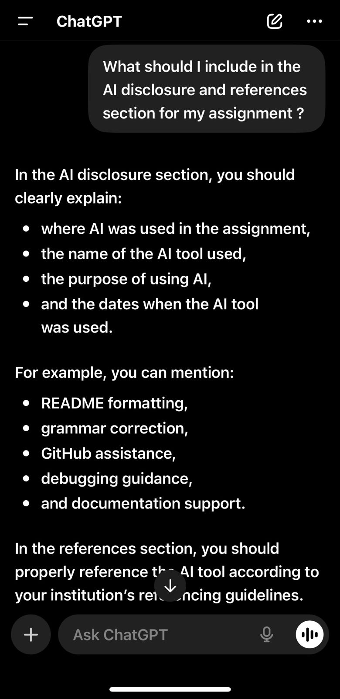

# HackOrMythApp

## 📱 Description
This is a simple Android quiz application where users answer "Hack or Myth" questions and receive a score at the end.

## 🚀 Features
- Start quiz button
- Multiple questions (Hack or Myth)
- Score calculation
- Feedback based on score
- Review answers feature

## 📸 Screenshots

### Home Screen

### Quiz Screen

### Score Screen

## 🎥 Video Demo
[Watch the demo](https://youtu.be/22OHlc0RKyI?si=kOo5BvjqXFBHAj8Z)

## 🛠️ Technologies Used
- Kotlin
- Android Studio

## ✅ Testing
The application was tested on an Android emulator and runs correctly without crashes.

## 📌 Author
Nathan Kabongo ST10458304

## References 
OpenAI. 2026. Chat-GPT (Version 5.5) [Large language model]. Available at: https://chat.openai.com/ [Accessed:24 April 2026]

# Disclosure of AI Usage in my Assessment

## Sections where AI was used
- README formatting
- Grammar correction
- Git and GitHub assistance
- Debugging assistance 
- Documentation guidance

## Name of AI tool used
- ChatGPT (OpenAI)

## Purpose of AI usage
_ Assisting with README structure and formatting
- Correcting grammar and wording 
- Explaining GitHub and Git commands 
- Providing debugging guidance
- Assisting with documentation

## Dates AI was used
- April 2026
- May 2026

## Evidence of AI usage

### Figure 1: README formatting assistance (OpenAI, 2026)

### Figure 2: Grammar correction assistance (OpenAI, 2026)

### Figure 4: Git and GitHub assistance (OpenAI, 2026)

### Figure 6: Debugging assistance (OpenAI, 2026)

### Figure 8: AI disclosure guidance (OpenAI, 2026)
